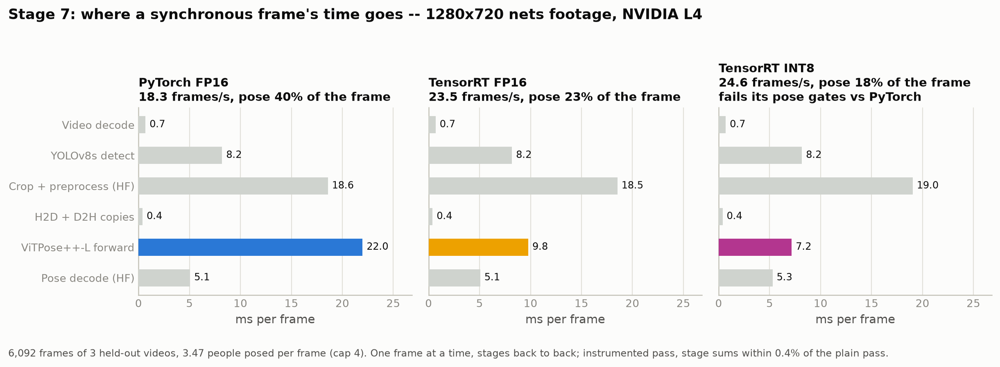
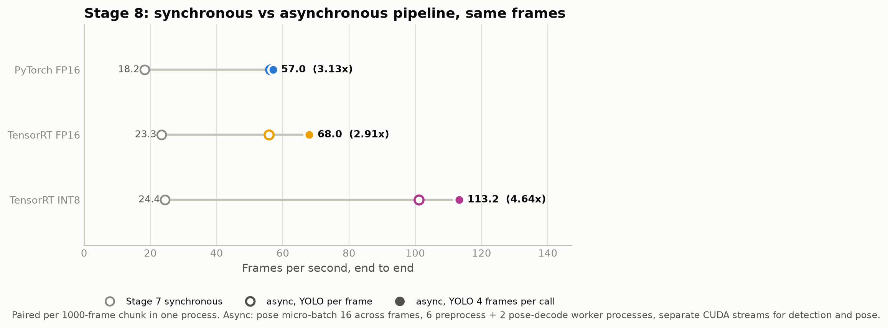
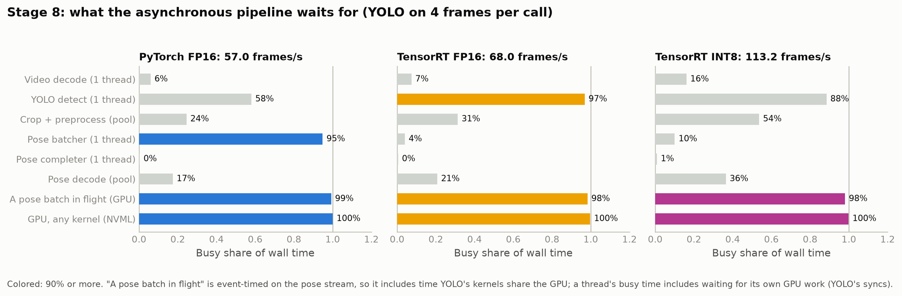
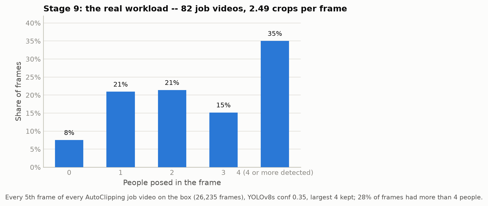
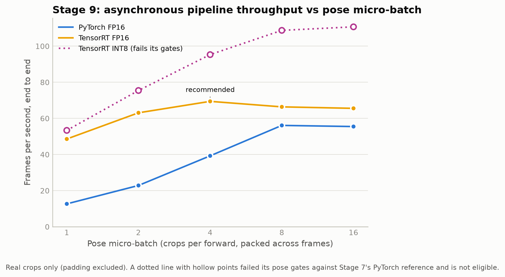
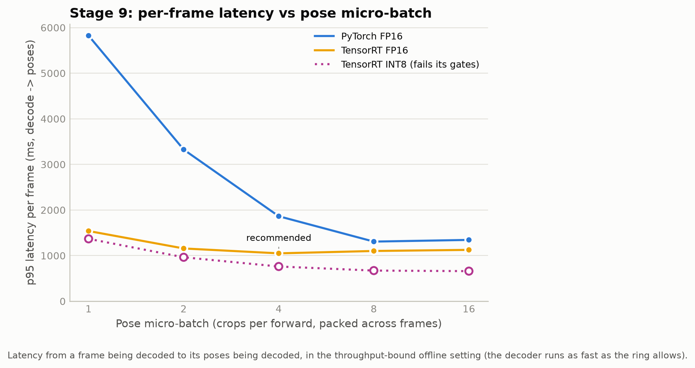
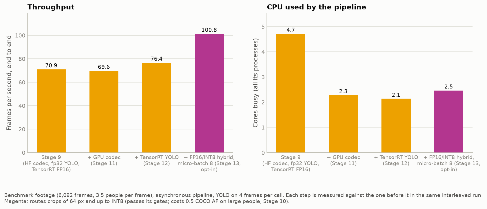
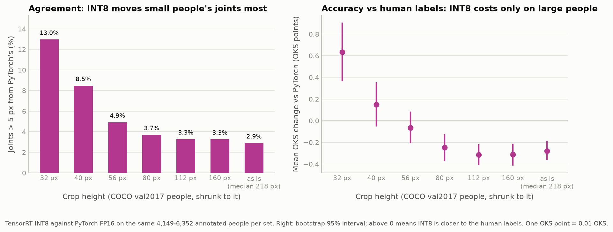
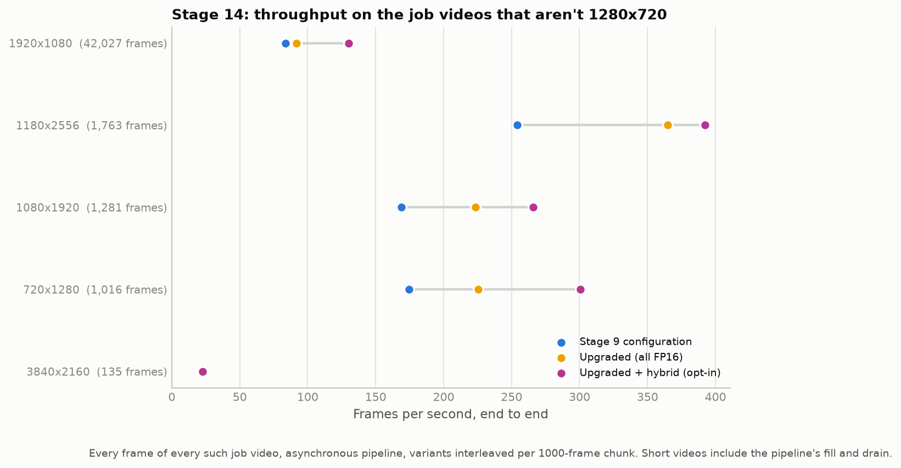

# ViTPose++-L Inference Optimization & Benchmarking

How far can ViTPose++-L inference be optimized on an NVIDIA L4 without moving the poses?
This repo benchmarks PyTorch, ONNX Runtime and TensorRT (FP16 and INT8) against each other,
first on the pose model alone and then inside a real video pipeline. Each step has to pass
correctness gates before its speed is reported.

## Results at a glance

| | Result | Stage |
|---|---|---|
| **Pose model alone, batch 1** | TensorRT FP16 5.07 ms: 4.08x PyTorch FP16, 2.05x ONNX Runtime with its own graph fusion | [3](#stage-3--tensorrt-fp16) |
| **Pose model alone, batch 16** | TensorRT's lead over PyTorch shrinks to 1.34x; INT8 adds 1.74x over TensorRT FP16 | [4](#stage-4--batch-size-sweep), [6](#stage-6--tensorrt-int8) |
| **Synchronous video pipeline** | 23.5 frames/s. TensorRT's 2.25x faster forward is only 1.28x end to end; HF's crop warp is the bottleneck | [7](#stage-7--a-synchronous-video-pipeline) |
| **Asynchronous pipeline** | 68.0 frames/s, 2.9x the synchronous one, same poses | [8](#stage-8--an-asynchronous-pipeline) |
| **Production configuration** | TensorRT FP16, micro-batch 4: 69.4 frames/s on the benchmark footage, ~92 projected on the real 720p workload | [9](#stage-9--the-production-configuration) |
| **Accuracy vs human labels** | TensorRT FP16 = PyTorch (COCO AP 0.809); INT8 −0.5 AP | [10](#stage-10--accuracy-against-human-labels-coco) |
| **Upgraded pipeline (all FP16)** | GPU crop warp + decode and a TensorRT detector: 76.4 frames/s with half the CPU | [11](#stage-11--gpu-crop-warp-and-pose-decode), [12](#stage-12--a-tensorrt-detector) |
| **Whole fleet, all 82 job videos** | Stage 9's configuration 87.8 frames/s; upgraded 97.8 (+11%); hybrid 136.7 | [14](#stage-14--the-rest-of-the-workload) |
| **Opt-in FP16/INT8 hybrid** | 100.8 frames/s on 720p footage; fails its pose gate on the larger-resolution videos | [13](#stage-13--an-fp16int8-hybrid), [14](#stage-14--the-rest-of-the-workload) |

All numbers are from one NVIDIA L4 (TensorRT 11.3, PyTorch 2.14, CUDA 13.0), a box shared with
a production service, measured with the contention guard described in
[Stage 7](#how-it-was-measured).

## How the repo is organized

The work is split into stages. Each stage has its own section below with its question, result,
commands and output files.

- **Stages 0–9 are the main track.** They end with the production configuration (Stage 9).
  - 0–6: the pose model alone. PyTorch, ONNX Runtime, TensorRT FP16 across batch sizes, GPU
    profiling, and INT8.
  - 7–9: the video pipeline around it. Synchronous, then asynchronous, then tuned for the real
    workload.
- **Stages 10–14 are follow-ups done after Stage 9,** taken from its list of open items:
  - 10: check accuracy against human labels (COCO), not just agreement with PyTorch.
  - 11–13: upgrade the pipeline one part at a time. GPU crop warp and decode, a TensorRT
    detector, and an FP16/INT8 hybrid as an option.
  - 14: measure the job videos that aren't 1280×720, and project throughput onto the whole
    fleet.

## System architecture


ViTPose is top-down: YOLOv8s finds each person's box, the crop is warped and normalized,
ViTPose++-L predicts heatmaps for it, and the heatmaps are decoded back into image-space
keypoints. Stages 0–9 optimize only the pose model. The detector, crop warp and decode are held
fixed across backends, so every comparison is "did the pose model get faster", not "did the
pipeline change". Stages 11–12 then replace the crop warp, the decode and the detector, each
gated against the version it replaces.

## Setup

```bash
pip install -r requirements.txt
huggingface-cli download usyd-community/vitpose-plus-large --local-dir checkpoints/vitpose-plus-large
```

- **Detector weights:** any YOLOv8 `.pt` at `checkpoints/yolov8s.pt`, or pass
  `--detector path.pt`. Without it, ultralytics downloads its default `yolov8s.pt`.
- **Engines:** TensorRT engines are locked to the GPU, TensorRT, CUDA and driver versions, so
  they are never committed. Each build writes a manifest (`results/tensorrt/*metadata.json`)
  with the ONNX and engine hashes and the environment. `backends/tensorrt.py` checks the
  manifest against the live environment before loading an engine and names any mismatched field.
- **Private data:** Stages 6–9, 11–14 use private cricket-nets footage, which is not in the repo
  (see [Repo conventions](#repo-conventions)). Stages 10 and 12 use public COCO val2017.

Every figure is generated from the committed result files, never hand-typed:

```bash
python visualizations/generate_all.py
```

`visualizations/_data.py` is the only code that reads the result JSON. If a file is missing it
fails and prints the command that produces it. It also rejects implausible values, such as a
negative latency.

---

# Main track: the pose model (Stages 0–6)

## Stage 0 — baseline

`baseline.py` loads ViTPose++-L, poses one image (YOLO supplies the box), checks the decoded
keypoints for hard invariants, and benchmarks the forward pass alone.

```bash
python baseline.py --image path/to/photo.jpg
```

- **Checks:** finite values, sane scores, coordinates inside the image. That catches a broken
  weight port or a transposed coordinate mapping; it is not an accuracy metric (Stage 10 is).
- **Frozen reference:** `results/baseline/l4_fp16.json` has the latency percentiles,
  throughput, peak VRAM, the checkpoint's SHA-256 and the full environment. `results/baseline/`
  also has the `nvidia-smi` output and `pip freeze` from that run. Later "N× faster" claims are
  measured against it.

## Stage 1 — benchmark harness and golden reference

`stage1_benchmark.py` adds the measurement tooling every later stage uses.


- **Stage-split timing:** detection, crop + preprocess, pose forward and postprocess, each
  bracketed by CUDA syncs. The per-stage times add up to an unsynced end-to-end run within 1.0%
  (tolerance 10%), which catches a misplaced sync.
- **Noise floor:** an empty sync-bracketed loop measures 0.018 ms, so stages near that
  resolution aren't over-read.
- **Golden reference:** `golden/person_crop.npy` and the raw fp16 heatmaps
  `golden/pytorch_fp16_output.npy`. They are generated under cuDNN determinism and proven
  bit-identical across repeated runs before saving. `golden/env.json` records the environment.
- **`compare_golden.py`:** the comparator every later backend is gated with. It checks the raw
  tensor error and, separately, the keypoint distance after decoding.


The pose forward dominates: 21.7 ms of ~35.9 ms end to end at batch 1.

```bash
python stage1_benchmark.py --image samples/sample.jpg   # -> results/raw/stage1_report.json, golden/
```

## Stage 2 — PyTorch → ONNX

Four gates, each blocking the next:

1. **Export** (`conversion/export_onnx.py`): the pose model alone, opset 18, static 256×192,
   `optimize=False` for a faithful graph.
   - A dynamic batch axis fails. The HF backbone's windowed attention bakes literal `[1, ...]`
     shapes into its reshapes, and `torch.export` specializes the batch dim to 1.
   - Every later stage therefore builds one static export per batch size.
2. **Structure** (`conversion/inspect_onnx.py`): `onnx.checker` passes. 3,418 nodes, 23 op
   types.
3. **Equivalence** (`tests/test_onnx_equivalence.py`): against the golden output, max abs error
   0.00098 and keypoints within 0.02 px mean / 0.04 px max.
4. **Performance** (`backends/onnxruntime.py`): timed with GPU-resident IOBinding, so ORT isn't
   charged a copy PyTorch doesn't pay.

| Batch 1, FP16 | Mean | P99 | FPS | vs PyTorch |
|---|---|---|---|---|
| PyTorch (Stage 0) | 20.69 ms | 21.70 | 48.3 | 1.00x |
| ONNX Runtime, faithful graph | 18.34 ms | 18.63 | 54.5 | 1.12x |
| ONNX Runtime + its own graph optimizations | 10.36 ms | 10.60 | 96.5 | **2.00x** |

**The 2x comes from ORT's graph fusion, not from leaving PyTorch.** The faithful graph alone is
1.12x. VRAM isn't compared: ORT's arena and PyTorch's caching allocator count memory
differently (raw numbers in `results/onnx/benchmark.json`).

```bash
python -m conversion.export_onnx && python -m conversion.inspect_onnx
pytest tests/test_onnx_equivalence.py -v
python -m backends.onnxruntime
```

## Stage 3 — TensorRT FP16

`conversion/build_engine.py` builds from the **faithful** ONNX export, pinned by hash. It won't
build from the ORT-optimized graph, so TensorRT isn't credited with ORT's rewrites.

| Batch 1 | Mean | P99 | FPS | vs PyTorch | vs ORT + fusion |
|---|---|---|---|---|---|
| TensorRT FP16 | 5.07 ms | 5.10 | 197.1 | **4.08x** | **2.05x** |

- **TensorRT 11.3 has no `BuilderFlag.FP16`.** Precision comes from a `STRONGLY_TYPED` network
  that takes the ONNX graph's dtypes as given. The built engine's per-layer dtypes are read back
  rather than assumed: 179 of 180 layers run in FP16.
- **Equivalence** (`tests/test_tensorrt_equivalence.py`):
  - Keypoints are within 0.06 px mean / 0.25 px max of the golden reference.
  - The max-relative-error threshold is 0.15, not ONNX's 0.10. The one outlier is a background
    heatmap pixel (value ~0.002) 11 px from any joint.
- **Smoke builds:** `--mode smoke` builds in ~20 s for pipeline checks (not for benchmarks).
  `--mode tuned` is the benchmarked engine.

```bash
python -m conversion.build_engine --mode tuned
pytest tests/test_tensorrt_equivalence.py -v
python -m backends.tensorrt
```

## Stage 4 — batch-size sweep

**Does TensorRT keep its advantage when batching?** Mostly not.

A batch of B copies of one crop can't reveal cross-slot bugs, since every slot's correct answer
is the same. `golden/build_distinct_batch.py` builds 16 distinct crops, each with a different
MoE `dataset_index`. Every backend's batch run checks each slot against that crop's own
standalone result before any latency counts, and all 15 backend × batch cells pass. Engines are
built per batch size (`engines/vitpose_b{1,2,4,8,16}_fp16.engine`).

| Batch | PyTorch FPS | ORT FPS | TensorRT FPS | TensorRT vs PyTorch |
|---|---|---|---|---|
| 1 | 47.4 | 97.0 | 197.6 | **4.17x** |
| 2 | 92.1 | 140.9 | 267.5 | 2.90x |
| 4 | 188.4 | 168.2 | 295.2 | 1.57x |
| 8 | 225.3 | 186.9 | 290.2 | 1.29x |
| 16 | 232.5 | 173.2 | 310.8 | 1.34x |

<p align="center"> </p>

- **The advantage shrinks with batch size.** PyTorch's batching amortizes its per-op overhead,
  which was most of TensorRT's batch-1 lead.
- **The curves aren't monotonic.** ORT peaks at batch 8, and TensorRT dips at 8 before rising
  at 16. Don't extrapolate them.
- **VRAM barely moves:** 2,849 → 2,949 MB from batch 1 to 16. Engine weights (~833 MB) and the
  CUDA context dominate; only the activation workspace (5 → 68 MB) scales. TensorRT 11.3 exposes
  this as `ICudaEngine.device_memory_size_v2`, not `IExecutionContext.device_memory_size`.

<p align="center"></p>

```bash
python -m golden.build_distinct_batch
for B in 1 2 4 8 16; do
  python -m conversion.export_onnx --batch-size $B
  python -m conversion.build_engine --batch-size $B --mode tuned
  python -m backends.pytorch --batch-size $B
  python -m backends.onnxruntime --batch-size $B
  python -m backends.tensorrt --batch-size $B
done
python aggregate_batch_matrix.py          # -> results/batch_matrix.json
```

## Stage 5 — GPU profiling

Full write-up: [`profiling/README.md`](profiling/README.md). It uses only tools already on the
box (TensorRT's `IProfiler`, `torch.cuda.Event`); `nsys` and `ncu` aren't installed.

- **Stage 4's benchmark loop has no real copies or decoding.** With them, H2D and D2H copies are
  negligible. Postprocessing is 25.6% of a TensorRT call at batch 1 and 36.7% at batch 16, and
  it doesn't batch. (Stage 7 later shows this isn't the pipeline's bottleneck.)
- **No dominant layer:** cost is spread evenly over the 24 transformer blocks.
- **Neither backend is near a hardware ceiling.** Measured latency never gets within 41% of
  either the compute or the bandwidth floor.
- **Why the ratio shrinks:** TensorRT removes a large fixed per-op overhead that dominates
  PyTorch at batch 1. At larger batches PyTorch's own GEMMs amortize that overhead, so the ratio
  falls even though neither backend is saturated.

## Stage 6 — TensorRT INT8

**Does INT8 buy speed without moving the pose?** Yes, from batch 4 up, on the crops it was
calibrated for.

**The first INT8 engine (commit `4efbbdd`) was broken.** It used ONNX Runtime's
`quantize_static` defaults and a calibration set made from perturbations of the golden crop.
- **Accuracy:** 72 px keypoint error on the golden crop; 5.7 px median / 48 px p95 on real
  crops.
- **Speed:** no faster than FP16.
- **Why:** the same Q/DQ graph was equally wrong in ONNX Runtime, so the fault was the recipe,
  not TensorRT. It quantized residuals, LayerNorm, biases, Softmax and the output. It also used
  float16 scales at opset 18, which the ONNX spec doesn't allow.

**The recipe** (`conversion/quantize_onnx.py`), found by bisecting the graph by consumer type:

- Q/DQ on **MatMul inputs only**: per block, the 12 Linear MatMuls (q, k, v, attention output,
  fc1, fc2, six MoE experts) and the two attention activation×activation MatMuls. LayerNorm,
  GELU, Softmax, residuals, biases, the MoE mask, the patch embedding and the head stay FP16.
- Weights: per-output-channel symmetric INT8.
- Activations: per-tensor, at the 99.99th percentile of |x| over 256 real calibration crops.
  Softmax outputs use amax 1.0.
- Scales are committed (`results/onnx/int8_calibration_scales.json`), so rebuilding needs no
  footage. Opset 19; `onnx.checker` passes with `full_check=True`.

**The data is real footage.** `calibration/real_corpus.py` cuts person crops from cricket-nets
videos with the production detector and crop warp.
- **Split by video:** 256 calibration crops from 7 videos and 400 evaluation crops from 3 other
  videos, with a content-fingerprint check against re-uploads.
- **Gate C** (`tests/test_tensorrt_int8_equivalence.py`) checks every evaluation crop against
  PyTorch FP16. It requires heatmap RMSE < 0.01, median < 0.6 px, p95 < 2.5 px, and under 1% of
  joints moved more than 5 px.

| Batch | INT8 img/s | FP16 img/s, same run | **INT8 / FP16** | Median | p95 | Joints > 5 px |
|---|---|---|---|---|---|---|
| 1 | 215 | 192 | 1.12x | 0.31 px | 1.28 px | 0.25% |
| 4 | 426 | 297 | 1.44x | 0.31 px | 1.27 px | 0.30% |
| 8 | 501 | 291 | 1.72x | 0.31 px | 1.27 px | 0.30% |
| 16 | 523 | 300 | **1.74x** | 0.31 px | 1.27 px | 0.30% |

- **INT8 pays only at batch ≥ 4.** At batch 1 the GEMMs (192 tokens) are too small to be
  compute-bound.
- **INT8 and FP16 are timed alternately in one process,** because the power-capped L4's clocks
  drift a few percent between runs.
- **Engine size:** 430–446 MB, against 833 MB for FP16.
- **Precision audit:** counted by input dtype, 264 of 324 layers at batch 1 run on INT8 data.
  Counting by output dtype is misleading, because an INT8 GEMM writes FP16 or FP32.
- **Rejected alternatives:**
  - Keeping the attention MatMuls in FP16 is slightly more accurate but falls to 445 img/s at
    batch 16.
  - Keeping fc2 and the experts in FP16 leaves only a 1.05x speedup.
- **Scope:** only `dataset_index` 0 (the COCO expert production uses) is calibrated and
  validated.

**Bugs found along the way:**
- **HF's pose decode misdecodes at ≥ 300 boxes per call.** Its DARK step builds a flat index in
  float32, which stops being exact past 2²⁴ elements. `compare_golden.decode_crop_batch`
  decodes in chunks of 128.
- **TensorRT reads a strided input as if it were dense.** `run_inference` now refuses
  non-contiguous arrays.
- **ORT 1.30 can't expose this FP16 graph's intermediate tensors,** so calibration runs in
  PyTorch.

**In production it doesn't pay.** In AutoClipping, the production system this repo feeds, the
same recipe on its MoE-fused dynamic-batch export runs the forward at 595 img/s. That is 2.20x
its PyTorch path at a 64-crop chunk, with 0.31 px median error. End to end:
- **Speed:** 1.04x on 8 bowler videos and 1.02–1.22x on 2 stance clips. Pose is a small share
  of those jobs.
- **Output:** on 3 of the 8 bowler videos it changed which deliveries were found.
- **FP16 engine:** output-neutral there, but 1.00x.

Neither engine is enabled (`AutoClipping/test_output/vitpose_int8_2026-09-28/RESULTS.md`).

```bash
python -m calibration.real_corpus build --distill-dir <AutoClipping distill dataset>   # once
python -m conversion.quantize_onnx [--batch-size B]
python -m conversion.build_int8_engine [--batch-size B]
pytest tests/test_tensorrt_int8_equivalence.py -v
python -m backends.tensorrt --precision int8 [--batch-size B]
```

---

# Main track: the video pipeline (Stages 7–9)

## Stage 7 — a synchronous video pipeline

**Where does a real frame's time go, and what is TensorRT worth end to end?**

`pipeline/sync_pipeline.py` runs each frame's stages in turn:
1. Decode the frame (`cv2`).
2. Detect people with YOLOv8s (fp32, conf 0.35).
3. Crop up to 4 people, largest first, with HF's crop warp. The cap and the order are
   AutoClipping's.
4. Run the pose forward.
5. Decode the poses with HF.

The TensorRT backends use the smallest static engine (b1/b2/b4) that fits each frame's crops.

**Footage:** the three Stage 6 held-out videos. That is 6,092 frames of 1280×720 cricket-nets
footage: one bowler clip and two stance clips, with 3.47 people posed per frame.

### How it was measured

This L4 also runs AutoClipping's production jobs and other sessions. An unguarded first run lost
every attempt to overlaps. Every measurement from Stage 7 on goes through `pipeline/runner.py`
and `pipeline/gpu_guard.py`:

- **Chunks:** 1000-frame chunks, with variants interleaved per chunk so clock drift hits them
  alike.
- **Quiet start:** a chunk starts only when no production job holds the GPU lock and the box
  has been quiet for 15 s. Quiet means the GPU is idle and other processes use under 1.5 CPU
  cores.
- **Discard on overlap:** the box is sampled every 0.5 s, and a chunk that overlapped anything
  is thrown away and re-run.
- **Checkpoints:** every clean chunk is saved, so an interrupted run continues with
  `--resume <tag>`.
- **Memory:** GPU memory is released while a production job runs. Those jobs can fill the card.
- **Two passes:** an instrumented pass (syncs at every stage boundary) for the breakdown, and a
  plain pass for throughput. The two agree within 0.4%.

### Results

| ms per frame | PyTorch FP16 | TensorRT FP16 | TensorRT INT8 |
|---|---|---|---|
| Video decode | 0.7 | 0.7 | 0.7 |
| YOLOv8s detect | 8.2 | 8.2 | 8.2 |
| Crop + preprocess (HF) | 18.6 | 18.5 | 19.0 |
| H2D + D2H copies | 0.4 | 0.4 | 0.4 |
| ViTPose++-L forward | 22.0 | **9.8** | 7.2 |
| Pose decode (HF) | 5.1 | 5.1 | 5.3 |
| **Frames/s** | 18.3 | **23.5** | 24.6 |



- **HF's crop warp is the bottleneck, not the pose decode.** It is 43% of a TensorRT frame,
  nearly twice the forward it feeds, because it converts the whole frame to a tensor and warps
  each crop with scipy on the CPU. Pose decode is 12%.
- **TensorRT's 2.25x faster forward is 1.28x end to end.** 77% of the frame is in stages it
  doesn't touch.
- **The GPU is busy only 38% of the time.** That idle time is Stage 8's target.

### Pose agreement: FP16 passes, INT8 fails on small crops

`pipeline/compare.py` compares each backend's poses with PyTorch's.
- **Units:** keypoint error in model-input pixels, over joints PyTorch scores above 0.3.
- **FP16 gates:** Stage 6's INT8 gates tightened 10x (median < 0.06 px, p95 < 0.25 px,
  < 0.1% of joints over 5 px). They were set before the first run.

| vs PyTorch, 351k joints | Median | p95 | Joints > 5 px | Gates |
|---|---|---|---|---|
| TensorRT FP16 | 0.015 px | 0.070 px | 0.02% | pass |
| TensorRT INT8 | 0.48 px | 6.0 px | 6.2% | **fail** |

| Crop height | Share of joints | INT8 median | INT8 p95 | INT8 > 5 px |
|---|---|---|---|---|
| Under 64 px | 32% | 1.98 px | 25 px | 18.3% |
| 64–128 px | 19% | 0.32 px | 1.3 px | 0.2% |
| 128 px and up | 50% | 0.31 px | 1.3 px | 0.7% |

**INT8 disagrees with PyTorch on people in the background.**
- **Where:** people in the neighbouring nets give 30–50 px crops, upsampled 5–8x into the model
  input. Stage 6's corpus started at 63 px, so it never tested them.
- **From 64 px up:** INT8 matches Stage 6.
- **What it meant then:** Stages 8–9 still measure INT8, but no INT8 configuration is eligible.
- **Accuracy:** Stage 10 later tested this against human labels, and the disagreement is not
  an accuracy loss.

```bash
python -m pipeline.sync_pipeline            # --resume <tag> continues an interrupted run
pytest tests/test_pipeline.py -v
```

## Stage 8 — an asynchronous pipeline

**How much of Stage 7's idle time can overlap recover, with the same stages and the same poses?**

```
decode thread ──> detect thread ──> preprocess ──> pose batcher ──> pose completer ──> pose decode ──> collector
(cv2 -> ring)     (YOLO, stream 1)   processes      (micro-batches,   (event wait,       processes
                                     (HF warp)       streams 2 + 3)    heatmaps -> ring)  (HF DARK)
```

`pipeline/async_pipeline.py`:
- **Every stage runs at once,** connected by queues.
- **CPU stages run in processes, not threads.** HF's pose decode is GIL-bound: 4 threads run it
  at 0.66x of one thread, while 4 processes give 3.4x (`pipeline/gil_check.py`).
- **Frames stay in a shared-memory ring** of 64 slots. Queues carry only indices and boxes, and
  a full ring blocks the decoder.
- **Micro-batching:** crops from consecutive frames are packed into micro-batches on the
  smallest engine that fits.
- **Three CUDA streams:** copies overlap the forward through two buffer sets, and YOLO has a
  stream of its own.
- **No device-wide syncs in detection.** Ultralytics' predictor calls `torch.cuda.synchronize()`
  around every stage, which would serialize the streams. `stages.detect_frames()` calls the
  predictor's methods without it.
- **Batched YOLO:** running YOLO on 4 frames per call makes it 2.5x cheaper per frame. Boxes
  move by 0.006 px median, so poses are compared with a 0.5 px box tolerance.

| Frames/s | Synchronous | Async, YOLO per frame | Async, YOLO ×4 |
|---|---|---|---|
| PyTorch FP16 | 18.2 | 56.3 | 57.0 |
| TensorRT FP16 | 23.3 | 55.8 | **68.0 (2.91x)** |
| TensorRT INT8 (fails Stage 7's gates) | 24.4 | 101.1 | 113.2 |



- **2.9x the synchronous pipeline with TensorRT FP16,** with poses within 0.021 px (median) of
  Stage 7's.
- **The limit is now the one GPU** that detection and pose share. NVML shows the GPU busy 100%
  of the time, and the detect thread spends most of its time waiting behind the pose stream.
- **Latency is the price:** about 1 s per frame (p95 1.07 s), against 43 ms synchronous. The
  decoder fills the 64-frame ring and every frame queues behind it (64 / 68 frames/s ≈ 0.94 s).
  That's fine for offline jobs; a live service would shrink the ring.



```bash
python -m pipeline.async_pipeline --backends trt-fp16 pytorch trt-int8
```

## Stage 9 — the production configuration

**Which backend and micro-batch give the most throughput on the real workload?**

**The workload** (`pipeline/workload_profile.py`): every 5th frame of the 82 distinct
AutoClipping job videos on the box.
- **People per frame:** 2.49 on average, against 3.47 in the benchmark footage. Bowler jobs
  average 2.68 and batsman jobs 1.94.
- **Resolutions:** 55 videos are 1280×720, 19 are 1920×1080, 7 portrait and 1 4K.



**The sweep** (`pipeline/production_config.py`) runs Stage 8's pipeline (YOLO ×4) at every
engine batch size, with all 15 configurations interleaved per chunk:

| Frames/s at pose micro-batch | 1 | 2 | 4 | 8 | 16 |
|---|---|---|---|---|---|
| TensorRT FP16 | 48.6 | 63.1 | **69.4** | 66.4 | 65.5 |
| PyTorch FP16 | 12.7 | 22.8 | 39.2 | **56.1** | 55.5 |
| TensorRT INT8 (fails its gates) | 53.3 | 75.4 | 95.3 | 108.7 | 110.7 |

<p align="center"> </p>

- **TensorRT FP16 peaks at micro-batch 4, not 16,** although b16 is the faster engine alone.
  A b16 batch is ~50 ms of pose kernels that YOLO's kernels wait behind; shorter batches let
  them interleave.
- **Micro-batch 4 also has the lowest latency,** and needs only the b1/b2/b4 engines (2.5 GB
  against 4.2 GB).
- **PyTorch needs micro-batch 8,** because its per-forward Python dispatch cost has to be
  amortized.
- **The flush timeout doesn't matter:** 10, 50 and 200 ms all give 69.2–69.5 frames/s.

**Projected onto the workload.** The best configuration of each backend is re-run with the
person cap at 1–4. The workload's people per frame is then read off those curves.

| Person cap | 1 | 2 | 3 | 4 |
|---|---|---|---|---|
| TensorRT FP16, micro-batch 4 | 178.7 | 110.5 | 81.9 | 69.4 |
| PyTorch FP16, micro-batch 8 | 153.2 | 91.1 | 66.7 | 56.0 |

Read at the 720p workload's average of 2.49 people per frame, TensorRT FP16 gives **91.8
frames/s**: 86.6 on bowler jobs and 112.3 on batsman jobs. That is 1.22x the best PyTorch
configuration. (Stage 14 projects each video at its own people per frame instead, which gives
87.9.)

### The recommendation

```
pose backend   TensorRT FP16, Stage 4 engines b1 + b2 + b4 (2.5 GB)
micro-batch    4 crops, packed across frames; partial batches flushed after 50 ms
detector       YOLOv8s fp32, 4 frames per call, on its own CUDA stream
CPU workers    6 crop/preprocess + 2 pose-decode processes (HF codec)
frame ring     64 frames in flight; per-frame latency ~ 64 / throughput
```

- **Benchmark footage:** 69.4 frames/s, 2.95x Stage 7's synchronous TensorRT pipeline.
- **The 5,374-frame bowler clip:** 79 s instead of 233 s.
- **Resolution:** measured at 720p only. [Stage 14](#stage-14--the-rest-of-the-workload)
  measures the rest of the fleet.

This configuration is for *this repo's* pipeline. AutoClipping's pipeline already batches 64
crops per forward with a GPU crop warp, so this ranking doesn't transfer to it without its own
measurement.

```bash
python -m pipeline.workload_profile            # ~6 min
python -m pipeline.production_config           # sweep + projection + recommendation, ~55 min
```

---

# Follow-ups after production (Stages 10–14)

Stage 9 left a list of open items. Stages 10–14 work through them.

- **Stage 10** checks accuracy against human labels (COCO).
- **Stages 11–13** change one part of Stage 9's pipeline each. Every step is measured against
  the one before it in the same interleaved run, on the same benchmark footage.
- **Stage 14** takes the result to the rest of the workload.



## Stage 10 — accuracy against human labels (COCO)

**Every accuracy number so far was agreement with PyTorch. Is the model actually right?**

`evaluation/coco_pose.py` scores each backend on COCO val2017 keypoints. That is 6,352
annotated people, with ground-truth boxes and COCO's OKS evaluation (pycocotools).
- **Processing:** the pipeline's own HF crop warp and decode, the COCO expert, no flip test.
  These are this repo's numbers, not a reproduction of the paper's.
- **Small people:** COCO has almost none under 64 px (0.4%), so each person is also evaluated
  **shrunk**. The image is downscaled until the crop is 32–160 px tall, with the annotation
  scaled alike.
- **Paired test:** each person is compared with PyTorch on the same person, with a bootstrap
  95% interval.

| COCO keypoint AP | Original (median crop 218 px) | 32 px | 56 px | 80 px | 160 px |
|---|---|---|---|---|---|
| PyTorch FP16 | 0.809 | 0.411 | 0.656 | 0.740 | 0.818 |
| TensorRT FP16 | 0.809 | 0.411 | 0.656 | 0.741 | 0.818 |
| TensorRT INT8 | 0.804 | 0.412 | 0.659 | 0.739 | 0.817 |



- **TensorRT FP16 is PyTorch.** The paired OKS difference is −0.0001, and its 95% interval
  includes 0.
- **INT8 costs accuracy only on large people.** It is −0.28 OKS points (−0.5 AP) at original
  size, significant, and −0.25 to −0.31 from 80 px up.
- **Where INT8 disagrees most, it isn't worse.** At 32–56 px INT8 moves 5–13% of joints by
  more than 5 px, yet it is neutral to slightly *better* against the labels (+0.63 OKS points
  at 32 px). Stage 7's INT8 "failure" on small crops was disagreement with FP16, not a loss of
  accuracy.
- **Stage 11's GPU crop warp and decode score AP 0.8087, the same as HF's.** The warp is
  bit-identical on every COCO crop.

```bash
# needs COCO val2017 images + person_keypoints_val2017.json under datasets/coco/ (gitignored)
python -m evaluation.coco_pose              # ~15 min -> results/evaluation/coco_pose.json
```

## Stage 11 — GPU crop warp and pose decode

**Can the crop warp and pose decode leave the CPU without changing a single number?**

HF's crop warp converts the whole frame to a tensor and warps each crop with scipy, one colour
channel at a time. Its decode runs ~17 scipy filters per crop in a Python loop.
`pipeline/fast_codec.py` reimplements both as batched operations:

- **GPU crop warp:** one Triton kernel for a whole micro-batch, reproducing scipy's float64
  bilinear arithmetic, rounding and borders. It is **bit-identical to HF's** on real frames and
  on COCO (`tests/test_fast_codec.py`).
- **GPU decode:** argmax + DARK + the inverse crop transform in torch. It agrees with HF's to
  ~1e-4 px.
- **cv2 crop warp** (the CPU alternative): fixed-point bilinear. Keypoints move 0.011 px
  median from HF's; it isn't bit-exact.

| Codec (TensorRT FP16, micro-batch 4) | Frames/s | CPU cores busy |
|---|---|---|
| HF (Stage 9) | 70.9 | 4.7 |
| cv2 warp | 70.6 | 3.9 |
| **GPU warp + decode** | 69.6 | **2.3** |

- **Throughput doesn't change,** because the pipeline is GPU-bound (Stage 8).
- **The GPU codec halves the CPU** and removes all 8 worker processes. Every frame's boxes are
  identical to the HF codec's, and poses pass Stage 9's FP16 gates.

## Stage 12 — a TensorRT detector

**Can detection get cheaper on the shared GPU without changing what it detects?**

`conversion/build_yolo_engine.py` builds a TensorRT FP16 engine for the unchanged YOLOv8s
weights. It has dynamic batch 1–4 and 320–640 px sides. Letterboxing and NMS stay ultralytics'
own; only the network call is swapped.
- **The head's tail stays FP32.** Its box-coordinate arithmetic would round to 0.25–0.5 px in
  FP16.
- **The mixed precision is traced from PyTorch,** because ONNX Runtime's FP16 converter produced
  an invalid graph.

| Detector (GPU codec) | Frames/s | Detect thread busy | People matched vs fp32 | COCO AP, detected boxes |
|---|---|---|---|---|
| YOLOv8s fp32 (Stage 9) | 69.0 | 70% | — | 0.741 |
| PyTorch fp16 | 73.6 | 66% | 99.92% | 0.741 |
| **TensorRT FP16** | **76.4** | 50% | 99.83% | 0.736 |

- **+11% throughput** over the fp32 detector. Both new detectors pass the detector gates
  against the fp32 detector's run. The gates require near-identical sets of people found, and
  those people's poses must pass Stage 6's INT8 thresholds.
- **A small, real accuracy cost.** `evaluation/coco_detected.py` runs the detector and pose
  model on all 5,000 COCO val2017 images. TensorRT's detections cost 0.37 OKS points per person
  (95% interval 0.21–0.54), −0.5 AP. PyTorch fp16 is no worse (+0.04 OKS points).

```bash
python -m conversion.build_yolo_engine          # -> engines/yolov8s_fp16.engine, results/tensorrt/yolo_engine_metadata.json
python -m evaluation.coco_detected              # ~10 min -> results/evaluation/coco_detected.json
```

## Stage 13 — an FP16/INT8 hybrid

**Can INT8's cheaper forward pay without its small-crop drift?**

The `trt-hybrid` backend in `pipeline/async_pipeline.py` sends crops under 64 px tall to the FP16
engine and the rest to INT8. The two routes are batched separately, and the 64 px threshold is
Stage 7's.

| Pose backend (GPU codec, TensorRT YOLO) | Micro-batch | Frames/s | p50 latency | vs FP16: median / p95 / > 5 px | INT8 gates |
|---|---|---|---|---|---|
| TensorRT FP16 | 4 | 75.4 | 887 ms | — | — |
| **Hybrid** | 8 | **100.8** | 645 ms | 0.19 / 1.08 px / 0.39% | pass |
| Hybrid | 16 | 102.9 | 631 ms | 0.19 / 1.08 px / 0.39% | pass |
| All INT8 (upper bound) | 16 | 127.8 | 524 ms | 0.48 / 6.0 px / 6.2% | **fail** |

- **On the benchmark footage the hybrid is 1.34x FP16** and passes Stage 6's INT8 gates. On
  crops under 64 px it matches FP16 to 0.02 px median.
- **The cost is INT8's own:** −0.5 COCO AP on people of normal size (Stage 10).
- **It stays opt-in, not the default.** It also fails its gate on the larger-resolution videos
  (Stage 14).

## Stage 14 — the rest of the workload

**What do Stage 9's configuration and the upgrades do on the videos that aren't 1280×720?**

That is 27 of the 82 job videos, 46,222 frames: 1080p, portrait and 4K.
- **Frames:** every frame of every such video, three configurations interleaved per chunk.
- **Reference:** each configuration is compared with a PyTorch FP16 pass over the same frames.



| Frames/s | Frames | Stage 9 | Upgraded (all FP16) | Upgraded + hybrid |
|---|---|---|---|---|
| 1920×1080 | 42,027 | 83.9 | 91.7 | 130.1 |
| 720×1280 portrait | 1,016 | 174.4 | 225.4 | 300.7 |
| 1080×1920 portrait | 1,281 | 169.0 | 223.5 | 266.0 |
| 1180×2556 portrait | 1,763 | 254.0 | 365.0 | 392.2 |
| 3840×2160 (4K) | 135 | 21.5 | 22.6 | 22.7 |
| **All 27 videos** | 46,222 | **87.6** | **96.4** | **135.3** |
| CPU cores busy | | 7.3 | 4.6 | 5.9 |
| vs PyTorch: median / p95 / > 5 px | | 0.015 / 0.068 px / 0.01% | 0.041 / 0.237 px / 0.05% | 0.35 / 2.17 px / **1.69%** |

"Upgraded" is the GPU codec (Stage 11) plus the TensorRT detector (Stage 12), with TensorRT FP16
pose at micro-batch 4.

- **The upgraded configuration is faster at every resolution** and uses 37% less CPU. Its poses
  stay within even the FP16 gates.
- **4K is bound by video decoding on the CPU.** The decode thread is 100% busy with ~11 cores
  in use, so no pose or detector change helps it.
- **The hybrid fails the > 5 px gate on this footage** (1.69% against a 1% limit). These videos
  have far more large crops, where INT8's error is highest: 4.6% of joints on crops of 512 px
  and up move more than 5 px. Only 2% of crops here are under 64 px and go to FP16.

**Projected onto the whole fleet.**
- **720p videos:** each configuration is re-run at person caps 1–4 on the benchmark footage,
  and each 720p job video is read off that curve at its own people per frame.
- **Other resolutions:** the throughput measured above.

| Frames/s | Stage 9 | Upgraded (all FP16) | Upgraded + hybrid |
|---|---|---|---|
| 55 videos at 1280×720, 84,791 frames (projected) | 87.9 | 98.5 | 137.5 |
| 27 other videos, 46,222 frames (measured) | 87.6 | 96.4 | 135.3 |
| **Whole fleet, 82 videos, 131,013 frames** | **87.8** | **97.8 (+11%)** | **136.7 (+56%)** |
| Hours per million frames | 3.16 | 2.84 | 2.03 |

- **The re-run matches Stage 9.** Stage 9's person-cap curve re-measured here gives 178.8 /
  110.1 / 82.2 / 69.1 frames/s at caps 1–4, against Stage 9's 178.7 / 110.5 / 81.9 / 69.4.
- **Projected per video, Stage 9's configuration gives 87.9 on the 720p videos, not 91.8.**
  Stage 9 read the fleet's *average* people per frame off the curve. Projecting each video at
  its own people per frame weights the crowded videos by the time they actually take.
- **Extrapolated videos:** 10 of the 55 have more people per frame than the benchmark footage's
  3.47 (5 are at the cap of 4 on every sampled frame, 22% of 720p frames). They are read off a
  line fitted through the curve's top three points, extrapolated up to the cap, and flagged in
  the JSON.

```bash
python -m pipeline.upgrades codec                              # Stage 11 -> results/pipeline/stage11_codec.json
python -m pipeline.upgrades detector                           # Stage 12 -> stage12_detector.json
python -m pipeline.upgrades pose                               # Stage 13 -> stage13_pose.json
python -m pipeline.upgrades resolutions --also-hybrid          # Stage 14 -> stage14_resolutions.json
python -m pipeline.upgrades projection --also-hybrid           # Stage 14 -> stage14_projection.json
pytest tests/test_fast_codec.py -v
```

## Open items

- **Other MoE experts.** Only `dataset_index` 0 (COCO) is calibrated or validated for INT8.
- **4K throughput** is limited by CPU video decoding. GPU decoding (NVDEC) would be the next
  step if 4K jobs become common.
- **Porting the upgrades to AutoClipping** needs its own measurement there. Its pipeline differs
  (64-crop batches, MoE-fused model), and Stage 6 showed an isolated speedup doesn't carry over
  by itself.

## Repo conventions

- **Not committed:** checkpoints, ONNX exports, engines and `results/raw/`. Raw per-frame outputs
  from private footage stay local; only aggregates are committed.
- **Committed:** `docs/images/*.png`, so the README renders on GitHub. They are build artifacts
  of `results/*.json`, regenerated with `python visualizations/generate_all.py`.
- **Private footage:** `calibration/real/` is gitignored; `calibration/real_manifest.json`
  records its content fingerprints (see `calibration/README.md`).
- **COCO:** `datasets/coco/` is gitignored; download val2017 and its keypoint annotations there.
