# ViTPose++-L Inference Optimization & Benchmarking

## Objective

How far can ViTPose++-L inference be optimized on an NVIDIA L4 while
preserving pose accuracy? The plan is PyTorch baseline → ONNX → TensorRT
(FP16/INT8) → video pipeline, each stage gated on the previous one being
*correct*, not just fast. PyTorch, ONNX Runtime, and TensorRT are competing
inference *backends* this repo benchmarks against each other -- not a
TensorRT-only exercise. The repo is built incrementally, stage by stage;
Stages 0-6 (through TensorRT FP16 with its batch-size sweep, GPU profiling,
and TensorRT INT8) exist so far -- the video pipeline stages do not yet.

## System Architecture

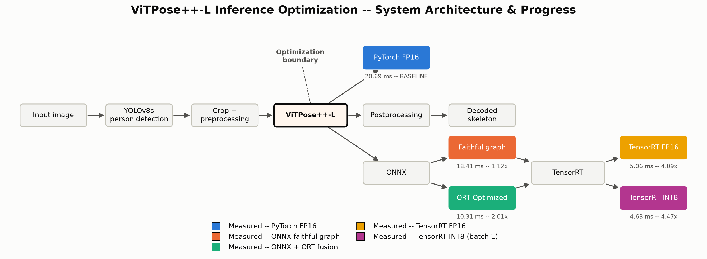

ViTPose is top-down: YOLOv8s finds the person box, the crop gets
preprocessed, ViTPose++-L runs pose estimation on the crop, and the
heatmaps get decoded back into image-space keypoints. The optimization work
in this repo targets **only the ViTPose++-L inference stage** -- the
detector, crop geometry, preprocessing, and decoding are held fixed across
every backend, so later comparisons are "did the pose model get faster,"
not "did we change the pipeline." Every branch (PyTorch FP16, ONNX
faithful graph, ONNX + ORT fusion, TensorRT FP16, TensorRT INT8) is measured
and drawn solid; a branch without a result file would be drawn dashed and
unfilled, with no number on it.

Every figure in this README is generated from the repo's actual result
files, never hand-typed:

```bash
python visualizations/generate_all.py
```

`visualizations/_data.py` is the single point of contact with the JSON
result files -- it fails loudly with the exact command to run if a required
file is missing (e.g. Stage 1's `results/raw/stage1_report.json`, which is
gitignored and only exists locally after running `stage1_benchmark.py`),
and it asserts physical plausibility (no negative latencies, ORT's
optimizations can't claim to be slower than the unoptimized graph, etc.) so
a JSON that exists but is wrong gets caught too. The PNGs under
`docs/images/` are committed -- a README needs its images to actually render
on GitHub -- but they're fully reproducible from `results/*.json`, which is
the real source of truth.

## Stage 0 — baseline (this stage)

`baseline.py` loads ViTPose++-L from a local checkpoint, runs it on a single
image, sanity-checks the output, then benchmarks latency / FPS / peak VRAM
on repeated forward passes.

ViTPose is top-down, so a YOLO detector supplies the person box; only the
ViTPose forward pass itself is timed — the detector is just how this stage
gets a realistic crop.

### Getting the checkpoint

The checkpoint is not in this repo (see `.gitignore`). Download the public
ViTPose++-L weights from Hugging Face:

```bash
huggingface-cli download usyd-community/vitpose-plus-large \
    --local-dir checkpoints/vitpose-plus-large
```

If you skip this, `baseline.py` falls back to the same hub id directly
(`transformers` will download and cache it on first use).

You'll also need person-detector weights (any YOLOv8 `.pt` works) at
`checkpoints/yolov8s.pt`, or pass `--detector path/to/weights.pt`. Without
either, ultralytics will download its own default `yolov8s.pt`.

### Running it

```bash
pip install -r requirements.txt
python baseline.py --image path/to/a/photo/with/a/person.jpg
```

Outputs land in `results/`:
- `baseline_sample.jpg` — the image with detected keypoints/skeleton drawn on it
- `baseline_report.json` — checkpoint/device/dtype, the decoded keypoints, and
  the benchmark stats (mean/p50/p95 latency, FPS, peak VRAM)

### What "correct" means here

`verify_output()` in `baseline.py` checks hard invariants on the decoded
keypoints (finite values, scores in a sane range, coordinates roughly inside
the image) — enough to catch a broken weight port, dtype cast, or a
transposed heatmap↔image coordinate mapping. It is not a pose-quality/accuracy
metric; COCO-style accuracy evaluation is a later stage.

### The frozen baseline

`results/baseline/l4_fp16.json` is the frozen Stage 0 reference number: mean
latency, P50/P95/P99, throughput, peak VRAM, the exact checkpoint (by
SHA-256) and the full environment (Python, PyTorch, Transformers, CUDA,
cuDNN, Ultralytics, NVIDIA driver) it was measured under. `results/baseline/`
also has the raw `nvidia-smi` output and a `pip freeze` snapshot from that
run. Later stages' "N% faster" claims are only meaningful measured against
this fixed point.

## Stage 1 — isolate ViTPose++-L, benchmark it properly, freeze a golden reference

`stage1_benchmark.py` builds on Stage 0's model/detector loading and pose
decoding (imported from `baseline.py` unchanged) and adds:

- **Stage-split timing** — YOLO detection / crop+preprocess / ViTPose
  inference / postprocess, each bracketed by CUDA syncs, plus a
  sync-additivity check (`sum(stage means)` vs. an independently-measured,
  no-intermediate-sync wall clock) that fails loudly if a misplaced sync
  point is silently misattributing latency between stages.

  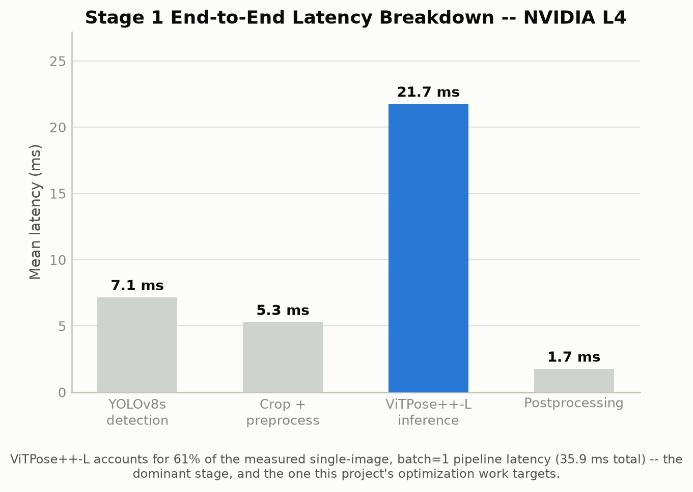

  ViTPose++-L is the dominant stage by a wide margin -- everything else in
  the measured single-image pipeline is a comparatively small, fixed cost.
- **Noise-floor calibration** — an empty sync-bracketed no-op loop, so a
  stage whose mean sits within a few multiples of the harness's own
  measurement resolution (crop+preprocess is the usual suspect) isn't read
  as clean signal.

### Benchmark methodology

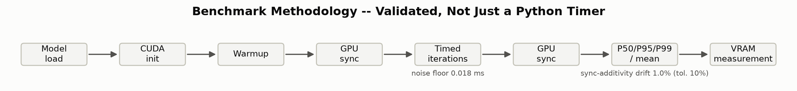

The point of this harness isn't "wrap the call in `time.time()`" -- warmup,
GPU synchronization on both sides of the timed region, and a measured noise
floor (0.018 ms, from an empty sync-bracketed no-op) all exist because CUDA
is asynchronous and a naive Python timer would measure dispatch latency, not
GPU work. The sync-additivity check (1.0% drift against a 10% tolerance)
independently verifies the stage-split timings above actually sum to the
measured end-to-end wall clock, catching a misplaced sync point before it
could silently misattribute latency between stages.
- **P50/P95/P99 + min/max** on top of Stage 0's mean/P50/P95 (`benchmark()`
  in `baseline.py`).
- **Batch-size sweep** (1/2/4/8/16) via `pixel_values.repeat(B, 1, 1, 1)` on
  the one real detected+preprocessed crop, reusing `benchmark()` unchanged —
  this measures ViTPose forward-pass compute/VRAM scaling under a *repeated*
  input, not a varied-input production batch (different crop content would
  additionally exercise the H2D copy path and any per-image resize cost).
  The allocator is reset with `torch.cuda.empty_cache()` between batch sizes
  within one process rather than paying the cost of a fresh Python process
  and full model reload per size; treat the peak-VRAM numbers as good but
  not airtight if you need bit-exact isolation.

  <table><tr>
  <td>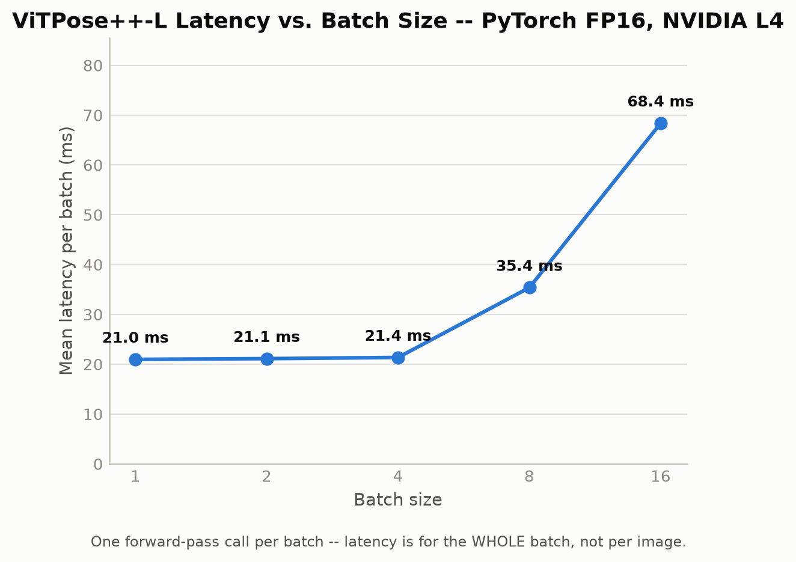</td>
  <td>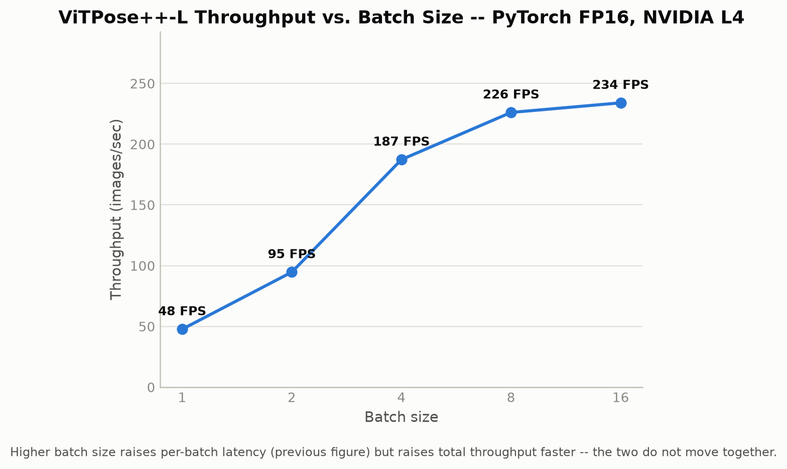</td>
  </tr></table>

  These are two separate figures, deliberately not one dual-axis chart:
  **latency per batch increases** with batch size (21 ms → 68 ms, one
  forward-pass call covering the whole batch) while **total throughput
  increases faster** (48 → 234 images/sec) -- a bigger, slower call that
  processes more images per call still wins on throughput. Collapsing both
  onto one chart with two y-scales would imply a relationship between them
  that isn't the actual finding; they answer different questions ("how long
  do I wait for one batch" vs. "how many images/sec can this sustain") and
  a production system cares about both separately, not their ratio.
- **Golden numerical reference** (`golden/person_crop.npy`,
  `golden/pytorch_fp16_output.npy`) — the fixed model input and the raw
  (pre-decode, pre-float-cast) fp16 heatmap output, generated under pinned
  cuDNN determinism (`deterministic=True`, `benchmark=False`, fixed seed) and
  *proven* bit-identical across `--golden-runs` repeated forward passes
  before being saved; a non-reproducible "golden" reference is treated as a
  build failure, not a fixture. `golden/env.json` carries the exact
  torch/CUDA/cuDNN/GPU fingerprint it was generated under and the detection
  box, since bit-stability is only guaranteed on that fixed environment.
- **`compare_golden.py`** — diffs a candidate backend's raw heatmap `.npy`
  against the golden reference at both the raw-tensor level (max/mean
  absolute error, max relative error above a noise threshold) and the
  application level (per-joint Euclidean pixel distance after decoding both
  through the same `post_process_pose_estimation`). Not used by anything yet
  since ONNX/TensorRT don't exist — Stage 2 is the first real consumer.

```bash
python stage1_benchmark.py --image samples/sample.jpg
```

Outputs land in `results/raw/stage1_report.json` (stage-split table, noise
floor, batch sweep) and `golden/` (the reference pair + fingerprint).

## Stage 2 — PyTorch → ONNX, four gates

Four gates, each blocking the next: export, structural validation, numerical
equivalence, then (only after equivalence passes) a performance benchmark.

**Gate A — export** (`conversion/export_onnx.py`, `python -m conversion.export_onnx`).
Exports the model alone (not YOLO, not preprocessing) via
`transformers.exporters.OnnxExporter`, using the exact `golden/person_crop.npy`
input. Static 256×192 spatial shape, opset 18, `optimize=False` for a faithful
first graph.

A dynamic batch axis was attempted first, as originally planned, and **failed**:
`torch.export` raises `ConstraintViolationError: ... your code specialized it
to be a constant (1)`. Retracing with `Dim.AUTO` "succeeds" but silently
produces a fully static graph -- the FX trace has literal `[1, ...]` shapes
baked into several `view`/`reshape` calls inside the backbone's windowed
self-attention, not the symbolic batch size. This is a real constraint of the
current HF `VitPoseBackbone` implementation surfaced empirically, not a bug in
this script. The script falls back to a static batch=1 export automatically
and records the failure in `export_metadata.json`; batch-size sweeps against
ONNX Runtime are deferred until either the model is patched or a separate
static export per batch size is built.

**Gate B — structural validation** (`conversion/inspect_onnx.py`,
`python -m conversion.inspect_onnx`). `onnx.checker.check_model` plus
input/output names+dtypes+shapes, opset, and an operator histogram
(`results/onnx/structural_validation.json`) that doubles as a diffable control
fixture for future re-exports.

**Gate C — numerical equivalence** (`tests/test_onnx_equivalence.py`,
`pytest tests/test_onnx_equivalence.py -v`). Runs the exported graph through
ONNX Runtime's CUDA EP on the golden input and diffs against
`golden/pytorch_fp16_output.npy` via `compare_golden.py`'s comparator, at both
the raw-tensor level and the decoded-keypoint level -- both must pass
independently, since a tensor regression can still decode to a similar-looking
pose. Measured: max abs error 0.00098, max rel error 0.047 (fp16 noise on
small-magnitude heatmap values), mean/max keypoint distance 0.02px / 0.04px.

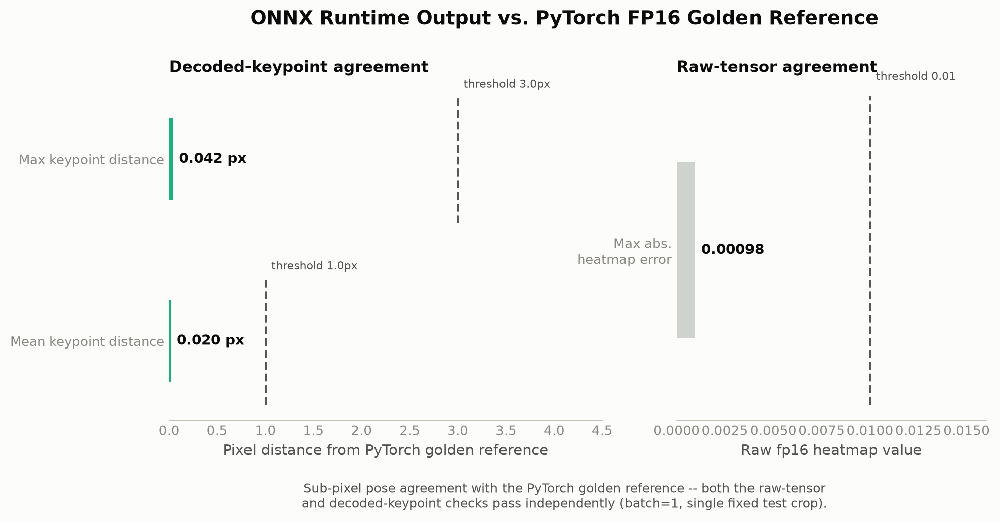

Sub-pixel pose agreement with the PyTorch golden reference -- both checks
pass independently, well inside their thresholds (this is a single fixed
test crop at batch=1, not a distributional claim over many images/poses).

**Gate D — ONNX Runtime performance** (`backends/onnxruntime.py`,
`python -m backends.onnxruntime`). Benchmarked twice, deliberately: ONNX
Runtime's `InferenceSession` applies its own session-level graph optimizations
by default (`ORT_ENABLE_ALL`) -- a separate knob from Gate A's export-time
`optimize=False` -- so a single number would conflate "ONNX Runtime's raw
engine overhead vs. PyTorch eager" with "gains from ORT's own graph fusion."

| Backend | Precision | Mean | P50 | P95 | P99 | FPS | Speedup vs PyTorch |
|---|---|---|---|---|---|---|---|
| PyTorch (Stage 0) | FP16 | 20.69 ms | 20.58 | 21.22 | 21.70 | 48.33 | 1.00x |
| ONNX Runtime, faithful graph | FP16 | 18.34 ms | 18.33 | 18.57 | 18.63 | 54.53 | **1.12x** |
| ONNX Runtime, ORT's own graph optimizations | FP16 | 10.36 ms | 10.36 | 10.55 | 10.60 | 96.53 | **2.00x** |

<table><tr>
<td>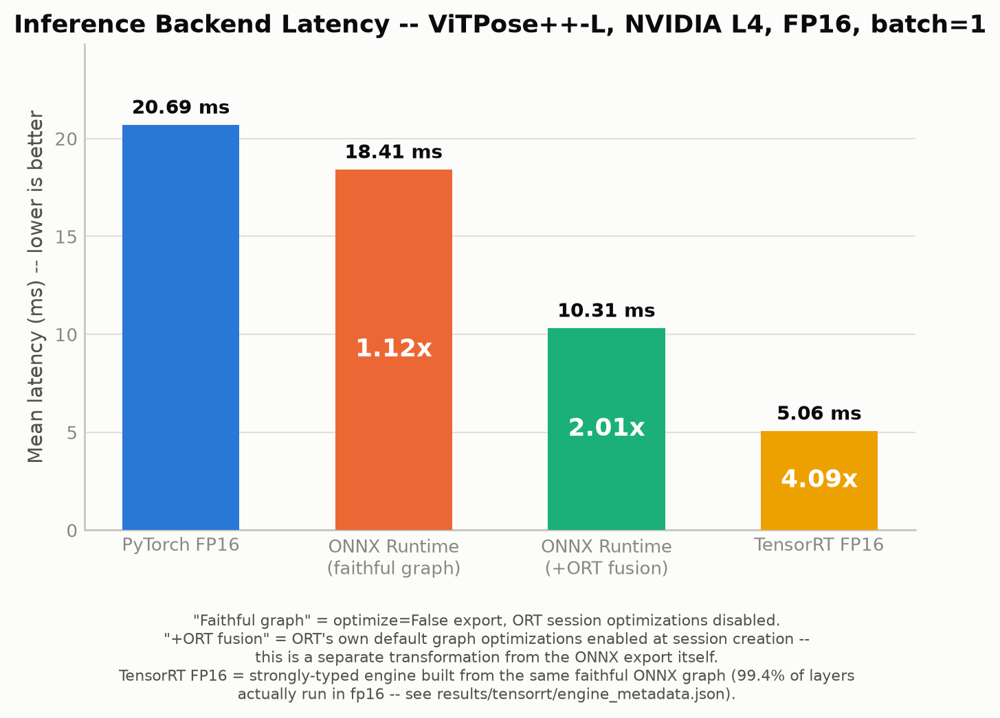</td>
<td>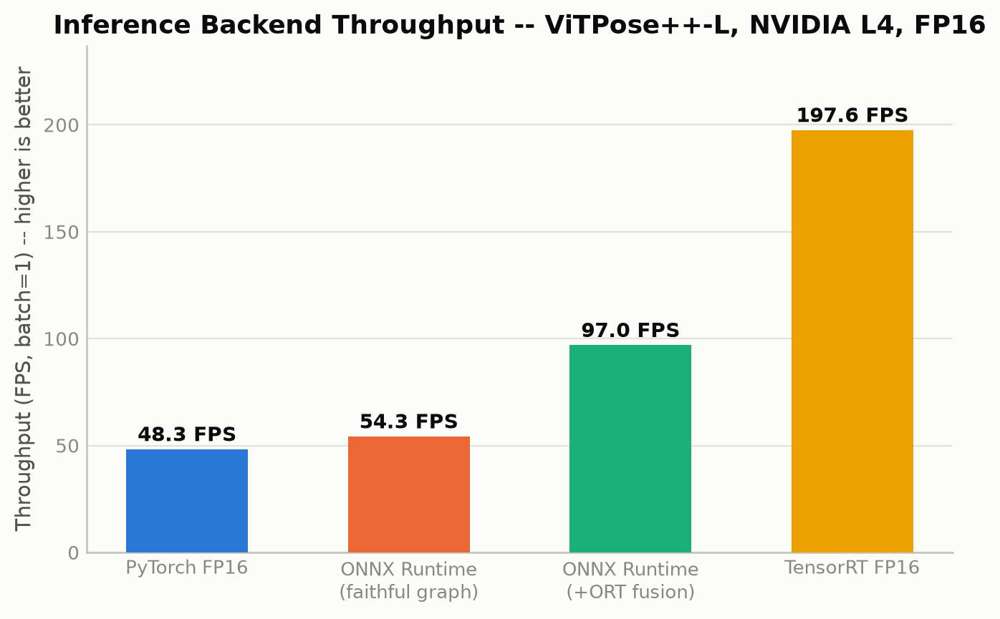</td>
</tr></table>

Batch=1 only (see Gate A). Both PyTorch and ONNX Runtime are timed through the
same sync-bracketed wall-clock helper (`baseline.time_calls`), with GPU-resident
IOBinding for ONNX Runtime so it isn't unfairly charged a host-to-device copy
PyTorch's timed region never pays. VRAM figures are omitted from this table
deliberately: ONNX Runtime's CUDA arena allocates via `cudaMalloc` directly, not
PyTorch's caching allocator, so the two backends' VRAM numbers use incompatible
accounting regimes (see `backends/onnxruntime.py`'s comments) -- raw figures are
in `results/onnx/benchmark.json`.

The honest headline is **raw engine overhead is a modest 1.12x; the "2x faster"
number is mostly ONNX Runtime's own graph fusion**, not something inherent to
running outside PyTorch eager mode. That fusion is a legitimate, real win for
a production deployment, but it's a different claim than "ONNX Runtime's
engine is fundamentally faster," and conflating the two was exactly the kind
of unfair-comparison risk Stage 2 was designed to catch before it reached a
results table.

```bash
python -m conversion.export_onnx      # Gate A
python -m conversion.inspect_onnx     # Gate B
pytest tests/test_onnx_equivalence.py -v   # Gate C
python -m backends.onnxruntime        # Gate D
```

Outputs land in `results/onnx/` (`export_metadata.json`,
`structural_validation.json`, `equivalence_report.json`, `benchmark.json`) and
`results/onnx/vitpose_plus_l.onnx` (+ `.onnx_data` sidecar, ~1.7GB checkpoint
in fp16, external data since it's close to the 2GB protobuf limit).

## Stage 3 — TensorRT FP16

Builds a TensorRT engine from Stage 2's exact, sha256-pinned **faithful**
ONNX export (never the ORT-optimized one -- `conversion/build_engine.py`
refuses to build if the ONNX file's hash doesn't match what Gate A recorded),
so any TensorRT speedup can't be silently crediting graph rewrites ONNX
Runtime already applied.

**A version-specific finding worth flagging:** TensorRT 11.3 has no
`BuilderFlag.FP16` at all -- the classic `config.set_flag(trt.BuilderFlag.FP16)`
API from older tutorials doesn't exist in this version. Precision now comes
from building a `STRONGLY_TYPED` network, which takes the ONNX graph's own
declared dtypes at face value; since our ONNX was exported from an
explicitly fp16-cast model, that IS the FP16 engine -- there's no separate
"permission" flag to set. This changes what a precision audit even means
here versus older TensorRT (there's no builder-chosen per-layer fp16-vs-fp32
selection to catch), but "the graph says fp16" and "the engine actually
executed every layer in fp16" still aren't automatically the same claim, so
`build_engine.py` reads the built engine's actual per-layer output dtypes
back via TensorRT's `EngineInspector` rather than assuming: **179/180 layers
(99.4%) executed in fp16**, one layer did not.

The engine itself is never committed -- see `.gitignore`'s `*.engine` rule --
it's a GPU/TensorRT/CUDA/driver-version-locked build artifact, not a
portable file like `model.safetensors`. What's committed is
`results/tensorrt/engine_metadata.json`: the full build manifest (exact
`onnx_sha256` it was built from, `engine_sha256` of the output, environment
fingerprint, the precision audit above). `backends/tensorrt.py` never
deserializes an engine blind -- it diffs the manifest against the live
environment field-by-field first and refuses with the exact mismatched field
named, rather than surfacing TensorRT's opaque deserialization error. An
engine that fails this check gets deleted and rebuilt, never patched.
`conversion/build_engine.py --mode smoke` (minimal tactic search, ~20s, not
benchmarkable) exists so routinely touching this repo later doesn't force a
multi-minute `--mode tuned` rebuild just to confirm the pipeline still works.

Numerical equivalence (`tests/test_tensorrt_equivalence.py`) reuses the exact
same `compare_golden.py` comparator and keypoint/tensor thresholds as Stage
2's ONNX test -- except `MAX_REL_ERROR_THRESHOLD`, which is set
independently for TensorRT (0.15, vs. ONNX's 0.10) with the reasoning
documented in the test file: the first run measured 0.108, just over ONNX's
threshold, and rather than silently loosening a shared threshold or leaving
an unexplained failure, it was root-caused to a single background heatmap
pixel 11px from the nearest joint peak (golden value ~0.002 -- deep
noise-floor territory), confirmed harmless by the keypoint-level check
passing at 0.06px mean / 0.25px max distance. TensorRT's own kernel/tactic
selection is a genuinely different numerical path than ONNX Runtime's; there
was no reason to expect its drift to match ONNX's calibration.

| Backend | Mean | P50 | P95 | P99 | FPS | Speedup vs PyTorch | Speedup vs ORT+fusion |
|---|---|---|---|---|---|---|---|
| TensorRT FP16 | 5.07 ms | 5.07 | 5.10 | 5.10 | 197.1 | **4.08x** | **2.05x** |

```bash
python -m conversion.build_engine --mode tuned      # build + precision audit + manifest
pytest tests/test_tensorrt_equivalence.py -v        # numerical validation
python -m backends.tensorrt                         # benchmark
```

Batch=1 only, matching Stage 2's export (see Stage 2's Gate A note on why
dynamic batch failed for this model). A static re-export at batch=2 was
confirmed to succeed (`torch.export` traces cleanly at any fixed batch
value -- it's specifically the *dynamic* axis that fails), so the batch
matrix (1/2/4/8/16, compared against Stage 1's PyTorch batch curve) is a
well-scoped next step, not a blocked one -- deliberately left for its own
controlled step rather than bundled in here (it became Stage 4). TensorRT
INT8 is Stage 6.

Outputs land in `results/tensorrt/` (`engine_metadata.json`, `fp16.json`,
`equivalence_report.json`); the `.engine` file itself stays local and
gitignored.

## Stage 4 — TensorRT FP16 batch-size sweep

**The question:** does TensorRT retain its advantage when processing
batches rather than individual crops?

Building this honestly required closing a gap that had been silently
inherited since Stage 1: every "batch" measurement in this project so far
(Stage 1's PyTorch sweep, the plan for ORT/TensorRT batch>1) used **B
copies of one crop** via `.repeat()`. That's fine for measuring
compute/VRAM scaling, but it's blind to cross-batch-element bugs -- if a
batch of identical inputs produces identical outputs, that's true whether
or not information leaked between batch slots, because every slot's
"correct" answer is identical to every other slot's anyway. This matters
specifically for this model: it has MoE routing via a `dataset_index`
gather/broadcast, and the exact windowed-attention mechanism that already
broke dynamic-batch ONNX export in Stage 2.

`golden/build_distinct_batch.py` builds a fixture that closes this: 16
GENUINELY DISTINCT crops (slot 0 is the real golden crop, unchanged; slots
1-15 are deterministic photometric+spatial perturbations of it), each
assigned a **different `dataset_index`** cycling through all 6 MoE
experts, each individually verified bit-stable and confirmed distinct from
every other slot. Every backend's batch>1 benchmark (`backends/pytorch.py`,
`backends/onnxruntime.py --batch-size B`, `backends/tensorrt.py
--batch-size B`) runs the full batch once and checks **every slot's**
output against that exact slot's own standalone golden result before any
latency number is trusted -- across all 15 (backend × batch-size) cells,
every slot passed.

`conversion/export_onnx.py --batch-size B` and `conversion/build_engine.py
--batch-size B` build 5 separate static exports/engines
(`vitpose_plus_l_b{2,4,8,16}.onnx`, `engines/vitpose_b{1,2,4,8,16}_fp16.engine`)
-- dynamic batch still isn't fixed (see Stage 2), so this works around it
the same way TensorRT does: one independently-tuned build per batch size,
never one engine reused 5 ways.

**A version-specific finding along the way:** `IExecutionContext.
device_memory_size` does not exist in TensorRT 11.3 either -- the real API
is `ICudaEngine.device_memory_size_v2`, found by checking the actual
installed package rather than older documentation (the same class of trap
as `BuilderFlag.FP16` in Stage 3). This is what makes the VRAM breakdown
below possible: engine weights, activation workspace, and steady-state
device VRAM are three physically distinct numbers, not one.

### Experiment 4A — throughput and latency vs. batch size

| Batch | PyTorch FPS | ORT FPS | TensorRT FPS | TRT vs. PyTorch |
|---|---|---|---|---|
| 1 | 47.4 | 97.0 | 197.6 | **4.17x** |
| 2 | 92.1 | 140.9 | 267.5 | **2.90x** |
| 4 | 188.4 | 168.2 | 295.2 | **1.57x** |
| 8 | 225.3 | 186.9 | 290.2 | **1.29x** |
| 16 | 232.5 | 173.2 | 310.8 | **1.34x** |

(All measured with the distinct-crop construction above, not `.repeat()` --
this is why the PyTorch column differs from Stage 1's original batch sweep,
which used repeated copies. Both are legitimate measurements of different
things; only this table's numbers are valid denominators for the speedup
ratios here.)

<p align="center">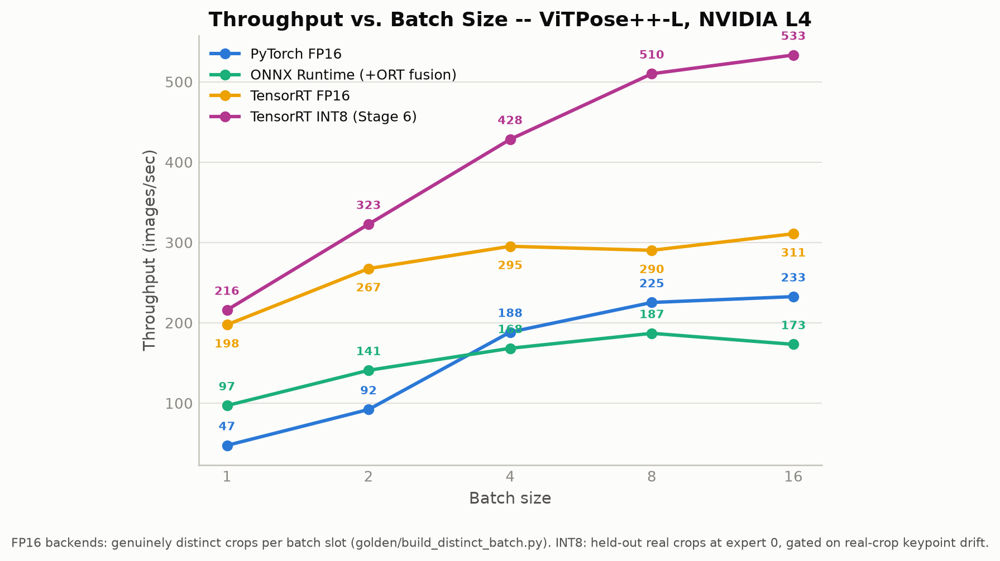 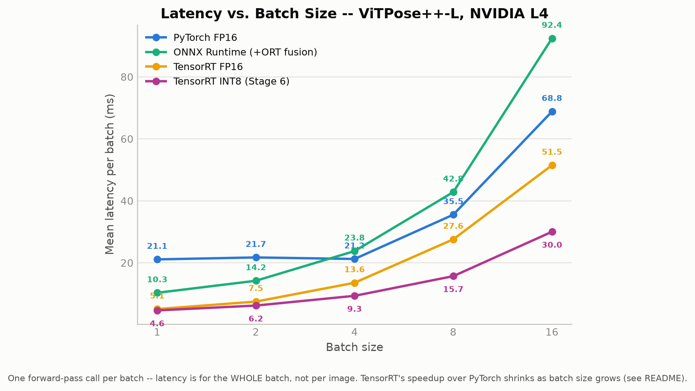</p>

**The honest headline: TensorRT's advantage shrinks dramatically as batch
size grows** -- from 4.17x at batch=1 to roughly 1.3x at batch=8/16. PyTorch
eager mode's own batching amortizes Python dispatch and kernel-launch
overhead far more effectively than its per-image cost suggested, closing
most of the gap TensorRT opened at batch=1. Neither curve is monotonic:
ONNX Runtime's throughput peaks at batch=8 (186.9 FPS) and *drops* at
batch=16 (173.2); TensorRT dips slightly at batch=8 (290.2) before rising
again at batch=16 (310.8). Don't assume any of these curves extrapolate.

### Experiment 4B — VRAM scaling

<p align="center">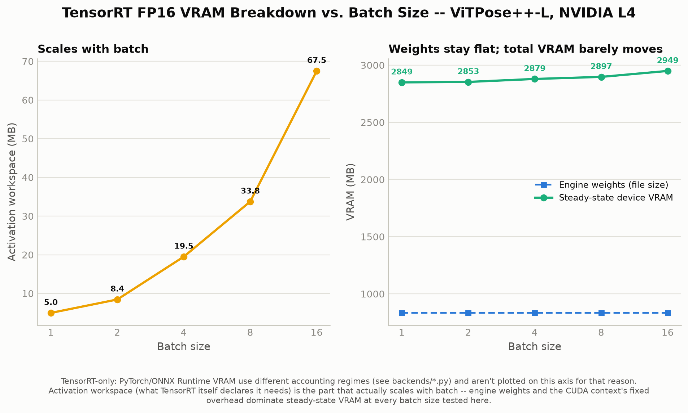</p>

Deliberately TensorRT-only, not a 3-backend comparison: PyTorch's
`peak_vram_mb`, and ONNX Runtime's/TensorRT's `device_vram_mb`, are three
different accounting regimes (see `backends/*.py`'s own comments on this) --
plotting them on one shared axis would imply a comparability that isn't
real. TensorRT's own three figures, from one consistent measurement path
across all 5 batch sizes: engine weights stay flat (~833MB, batch-invariant,
as expected), activation workspace scales with batch (5.0MB → 67.5MB,
1→16), and steady-state device VRAM barely moves (2849MB → 2949MB) because
weights and the CUDA context's fixed overhead dominate at every batch size
tested here. Batch size does raise VRAM, but the increase is a rounding
error next to the fixed cost of just having the engine loaded at all.

```bash
python -m golden.build_distinct_batch                        # once
for B in 1 2 4 8 16; do python -m conversion.export_onnx --batch-size $B; done
for B in 1 2 4 8 16; do python -m conversion.build_engine --batch-size $B --mode tuned; done
for B in 1 2 4 8 16; do python -m backends.pytorch --batch-size $B; done
for B in 1 2 4 8 16; do python -m backends.onnxruntime --batch-size $B; done
for B in 1 2 4 8 16; do python -m backends.tensorrt --batch-size $B; done
python aggregate_batch_matrix.py
```

Outputs land in `golden/distinct_crops.npy` + `distinct_pytorch_fp16_outputs.npy`
+ `distinct_batch_env.json`, per-batch files under `results/onnx/`,
`results/tensorrt/`, and `results/baseline/`, and the aggregated
`results/batch_matrix.json`.

## Stage 5 — GPU profiling: why is TensorRT fast, and why does the advantage shrink?

See **[`profiling/README.md`](profiling/README.md)** for the full writeup.
Short version: `nsys`/`ncu` aren't installed on this machine (would need
sudo + a new NVIDIA apt repo + a 500MB+ download); everything below uses
tools already installed with zero new footprint -- TensorRT's own
`IProfiler`, `torch.cuda.Event`, and arithmetic against Stage 4's own data.

- **A genuine H2D/exec/D2H/postprocess breakdown** (not Stage 4's benchmark
  loop, which was checked empirically to contain zero real memory copies or
  decoding -- see the "Finding 0" callout in `profiling/README.md`).
  Transfers are negligible at every batch size; **postprocessing is 25.6%
  of latency at batch=1, growing to 36.7% at batch=16** (CPU-bound, doesn't
  benefit from GPU batching) -- a direct preview of the bottleneck Stage
  7/8's video pipeline will hit.
- **TensorRT's own per-layer profiler** (zero new installs) shows no single
  dominant layer -- cost is evenly spread across the ViT-L backbone's 24
  transformer blocks. Each top layer's time grows ~11x for a 16x batch
  increase (sub-linear): a batching efficiency gain that **also helps
  PyTorch's own batched kernels**, not something TensorRT-exclusive.
- **A roofline check ruled out an intuitive-sounding explanation** rather
  than confirming one: measured latency never gets within 41% of either the
  compute or bandwidth theoretical floor, at any batch size -- this isn't a
  story about either backend approaching a hardware ceiling.
- **The actual mechanism**: TensorRT's fixed per-op overhead elimination is
  proportionally huge at batch=1 against an overhead-dominated PyTorch
  baseline; as batch grows, PyTorch's own batched GEMMs get more efficient
  too (independent of TensorRT), amortizing away the overhead that gave
  TensorRT its edge -- so the *ratio* shrinks even though neither backend
  is near the hardware ceiling.

## Stage 6 — TensorRT INT8

**The question:** does INT8 buy speed on this model without moving the pose?

### The first attempt shipped broken, and why that wasn't caught

The first INT8 engine (commit `4efbbdd`) ran ONNX Runtime's `quantize_static`
with its default op set, entropy-calibrated on Gate A's synthetic corpus, and
built fine. It was also wrong: **72 px mean keypoint error on the golden crop**,
and on real crops 5.7 px median / 48 px p95, with 57% of joints moved more
than 5 px. It was also **no faster than FP16** (5.09 vs 5.11 ms at batch 1, timed in the same process). Nothing
flagged it: it was only ever compared against the one golden crop, and its
calibration corpus was 96 perturbations of that same photo.

Running the **same Q/DQ graph in ONNX Runtime** gave the same error (76.6 px
on golden), so the TensorRT build was not the problem: the recipe was. ORT's
default quantized almost every tensor: residual Adds, LayerNorm gamma/beta,
every Linear bias, Softmax, the MoE mask arithmetic, and the heatmap output.
Its graph also carried float16 Q/DQ scales at opset 18, which the ONNX spec
doesn't allow (float16 scales arrived in opset 19); the old note calling the
`onnx.checker` failure a "checker limitation" was wrong, and ORT itself
refuses to load that graph. TensorRT's parser tolerated it.

### The recipe

Bisecting that graph by consumer type, without recalibrating, isolated it
(errors in 256×192 model-input pixels, against FP16, on 400 held-out real
crops, ONNX Runtime):

| Q/DQ kept on | Median | p95 | Joints > 5 px |
|---|---|---|---|
| everything (ORT default, as shipped) | 6.1 | 48.7 | 58.7% |
| MatMul + Conv inputs only | 0.44 | 1.77 | 0.33% |
| + per-channel weights | 0.42 | 1.65 | 0.15% |
| + real-footage calibration (p99.99) | **0.32** | **1.25** | 0.27% |

`conversion/quantize_onnx.py` now builds that directly on the faithful FP16
export instead of post-editing ORT's output:

- **Q/DQ on MatMul inputs only**: per block, the 12 Linear MatMuls (q, k, v,
  attention output, fc1, fc2, 6 MoE experts) and the 2 attention
  activation×activation MatMuls. LayerNorm, GELU, Softmax, residuals, biases,
  the MoE mask, the patch-embedding Conv and the deconvolution head stay FP16.
- **Weights**: per-output-channel symmetric INT8, absmax.
- **Activations**: per-tensor symmetric INT8 at the 99.99th percentile of
  |x| over 256 real calibration crops, collected in PyTorch with forward
  hooks (4 s, vs about an hour for the old ORT calibration). Softmax
  probabilities use amax 1.0 rather than a percentile, which would clip the
  largest attention weights.
- Scales are committed (`results/onnx/int8_calibration_scales.json`) and
  shared by every batch size's export, so rebuilding needs no footage.
- Opset 19; `onnx.checker.check_model(full_check=True)` passes.

Two alternatives were measured and rejected: keeping the attention
act×act MatMuls in FP16 is more accurate (0.30 vs 0.39 px median) but costs
throughput at batch 16 (445 vs 524 crops/s, since TensorRT fuses the
quantized attention much better); keeping fc2 + experts in FP16 leaves only
a 1.05× speedup.

### The calibration and evaluation corpus is real footage now

`calibration/real_corpus.py` builds it from an AutoClipping distillation
dataset: person crops from real cricket net videos, cut with the production
person detector and crop warp. 256 calibration crops come from 7 videos and
400 evaluation crops from 3 **other** videos (split by video, plus a
content-fingerprint check against re-uploads), with PyTorch FP16 reference
heatmaps stored for the evaluation crops. Crops are private footage:
`calibration/real/` is gitignored and only `calibration/real_manifest.json`
is committed (see `calibration/README.md`).

### Gate C: real crops, not the golden crop

`tests/test_tensorrt_int8_equivalence.py` runs all 400 held-out crops through
every INT8 engine in batches of B, checking each slot against that crop's
own reference. The four gates, in `compare_golden.py`: heatmap RMSE < 0.01,
median keypoint error < 0.6 px, p95 < 2.5 px, fewer than 1% of joints moved
more than 5 px. The old recipe fails every one by an order of magnitude.
The golden crop is still reported (2.8 px mean, 11.7 px max in source
pixels, against 72 px for the replaced engine) as a tripwire, since it's a harder case than typical.

### Results

Throughput is from `backends/tensorrt.py --precision int8`, which times INT8
and the same-batch FP16 engine in alternating rounds in one process. That
comparison is the ratio to use: the L4 here is power-capped, and its clocks
drift a few percent between runs, so dividing into `fp16*.json` from Stage 4
would fold that drift in. Accuracy is Gate C on the 400 held-out real crops,
in 256×192 model-input pixels.

| Batch | INT8 (img/s) | FP16, same run (img/s) | **INT8 / FP16** | Median error | p95 error | Joints > 5 px |
|---|---|---|---|---|---|---|
| 1 | 215 | 192 | **1.12x** | 0.31 px | 1.28 px | 0.25% |
| 2 | 318 | 261 | **1.22x** | 0.31 px | 1.27 px | 0.30% |
| 4 | 426 | 297 | **1.44x** | 0.31 px | 1.27 px | 0.30% |
| 8 | 501 | 291 | **1.72x** | 0.31 px | 1.27 px | 0.30% |
| 16 | 523 | 300 | **1.74x** | 0.31 px | 1.27 px | 0.30% |

**The honest headline: INT8 is worth it only at batch ≥ 4.** At batch 1
the GEMMs are too small (192 tokens per crop) to be compute-bound, and INT8
buys 12%. From batch 8 up it's 1.7x over TensorRT FP16. That's the regime
Stage 4 showed FP16 TensorRT running out of headroom in (its throughput
plateaus around 290–310 img/s from batch 4). Accuracy is the same at
every batch size, so each slot matches its own standalone reference and
nothing leaks between batch slots. Weights are half the size: the engine
file is 430–446 MB, against 833–835 MB for FP16.


### Precision audit

`conversion/build_int8_engine.py` reads every layer's input and output
dtypes back from the built engine. Classifying by output dtype alone (Stage
3's method) is misleading here, because an INT8 GEMM writes its dequantized
result as FP32 or FP16. At batch 1 that put 168 GEMMs in the "FP32" bucket.
Counting by input instead, **264/324 layers at batch 1 and 240/348 at batch
16 execute on INT8 data**:

- **Batch 1:** 168 `gemm: Int8 -> Float` and 24 `gemm: Int8 -> Int8` (the fused
  q/k/v projection).
- **Batch ≥ 4:** TensorRT fuses the same GEMMs with their epilogue into
  `fusion: Int8 -> Half` layers.
- **Still FP16:** the patch-embedding convolution, the deconvolution head, and
  the LayerNorm/GELU/softmax elementwise kernels, as the recipe intends.

### Findings along the way

- **HF's `post_process_pose_estimation` misdecodes at ≥ 300 boxes per call**
  (transformers 5.17): `post_dark_unbiased_data_processing` computes its
  flat heatmap index from float32 coordinates, which stop being exact past
  2²⁴ elements (300 crops × 17 × 66 × 50). Every box from index 299 on
  was decoded about 4 px off. `compare_golden.decode_crop_batch` decodes
  in chunks of 128. Earlier stages decoded one crop at a time and are
  unaffected.
- **ORT 1.30 can't expose intermediate tensors of this FP16 graph**
  (`InsertedPrecisionFreeCast` type error), which is why calibration runs in
  PyTorch.
- **TensorRT reads a strided input as if it were dense.** The first Gate C
  run failed at 48 px on every batch size while the golden crop passed.
  The real crops' pixel array was a transposed numpy view. PyTorch honours
  strides, TensorRT's `set_tensor_address` doesn't. `run_inference` now
  refuses non-contiguous inputs.

### In production: the MoE-fused engine, end to end

The same recipe and scales were applied to AutoClipping's MoE-fused,
dynamic-batch export (`scripts/export_vitpose_trt.py` there; profile
[1, 64, 128]). That export has 6 Linear MatMuls per block instead of 12, and
`analyze_graph` handles both. On the 400 real crops, INT8 is 0.31 px median /
1.25 px p95 at every batch size. The fused FP16 engine is 0.010 px.

The forward alone, at production's 64-crop chunk:

| PyTorch fused FP16 (production) | TensorRT FP16 | TensorRT INT8 |
|---|---|---|
| 270 img/s | 319 img/s | **595 img/s (2.20x)** |

End to end it doesn't pay. Across 8 bowler videos and 2 stance clips, with
AutoClipping's pipeline unchanged apart from `vitpose.engine`:

- **FP16 engine:** 1.00x, and outputs unchanged.
- **INT8 engine:**
  - Speed: 1.04x on bowler and 1.02–1.22x on stance. Pose is a small share
    of a job once detection, decoding and ball tracking are counted.
  - Output: it changes the delivery set on 3 of 8 bowler videos and shifts
    half the release frames. Release-aligned logic amplifies sub-pixel pose
    drift.

Neither engine is enabled there. Evidence:
`AutoClipping/test_output/vitpose_int8_2026-09-28/RESULTS.md`.

### Scope

Only dataset_index 0 (COCO, the expert production runs) is calibrated or
validated. The engine still accepts other experts, but their accuracy is
unmeasured. This is the unfused MoE graph: all 6 experts are still computed.

```bash
python -m calibration.real_corpus build --distill-dir <AutoClipping distill dataset>   # once
python -m conversion.quantize_onnx [--batch-size B] [--recalibrate]                    # Gate B
python -m conversion.build_int8_engine [--batch-size B]                                # build + audit
pytest tests/test_tensorrt_int8_equivalence.py -v                                      # Gate C
python -m backends.tensorrt --precision int8 [--batch-size B]                          # benchmark
python aggregate_batch_matrix.py && python visualizations/generate_all.py
```

## Key Findings

1. ViTPose++-L is the dominant stage in the measured single-image pipeline
   (21.7 ms of ~35.9 ms end-to-end, batch=1 -- see the stage breakdown above).
2. The initial dynamic-batch ONNX export was rejected: the current HF
   `VitPoseBackbone` implementation introduces a batch constraint through its
   windowed-attention reshaping (`torch.export` specializes the batch dim to
   a literal constant during tracing -- see Stage 2, Gate A).
3. A static batch=1 export was therefore used instead.
4. ONNX structural validation (Gate B) passed: `onnx.checker` clean, opset
   18, 23 unique op types across 3418 nodes, 689 initializers.
5. ONNX output agrees with the PyTorch golden reference within the measured
   sub-pixel differences (max abs tensor error 0.00098; mean/max keypoint
   distance 0.02px / 0.04px).
6. Faithful ONNX Runtime execution provides approximately **1.12x** speedup
   over the PyTorch baseline.
7. ONNX Runtime's own graph optimizations reduce latency substantially
   further, reaching approximately **2.00x** relative to the PyTorch
   baseline.
8. The 2.00x result must be attributed to ORT graph optimization/fusion, not
   merely to ONNX export -- the faithful (unoptimized) graph alone only
   accounts for the 1.12x figure.
9. TensorRT's own `BuilderFlag.FP16` API doesn't exist in TensorRT 11.3 --
   precision now comes from a `STRONGLY_TYPED` network taking the ONNX
   graph's own declared dtypes at face value. The engine's actual per-layer
   dtypes were still read back and verified (not assumed): 179/180 layers
   (99.4%) executed in fp16.
10. TensorRT FP16 measured at **5.07 ms / 197.1 FPS** -- **4.08x** speedup
    over the PyTorch baseline and **2.05x** over ONNX Runtime's own
    optimized graph, i.e. TensorRT extracts roughly another 2x on top of
    what ONNX Runtime's graph fusion already achieved, not just on top of
    PyTorch eager mode.
11. TensorRT's numerical equivalence gate needed its own threshold (0.15 vs.
    ONNX's 0.10 for max relative tensor error), root-caused to a single
    background heatmap pixel far from any joint peak, not a real
    regression -- confirmed by keypoint-level agreement (0.06px mean / 0.25px
    max) staying far inside its own thresholds either way.
12. Every batch>1 measurement in this project before Stage 4 (Stage 1's
    PyTorch sweep) used `.repeat()` -- B copies of one crop -- which cannot
    detect cross-batch-element bugs. Stage 4 built a 16-slot fixture of
    GENUINELY DISTINCT crops with a mixed `dataset_index` per slot
    (`golden/build_distinct_batch.py`) specifically to test the model's MoE
    routing and windowed-attention paths at batch>1; every slot, at every
    batch size, for every backend, passed.
13. **TensorRT's speedup over PyTorch shrinks dramatically as batch size
    grows**: 4.17x at batch=1, roughly 1.3x at batch=8/16. PyTorch eager
    mode's own batching amortizes overhead far more effectively than its
    per-image cost at batch=1 suggested. This is the actual answer to "does
    TensorRT retain its advantage at batch>1" -- mostly not, past batch=4.
14. Neither ONNX Runtime's nor TensorRT's throughput curve is monotonic:
    ORT peaks at batch=8 (186.9 FPS) and drops at batch=16 (173.2); TensorRT
    dips slightly at batch=8 (290.2) before rising again at batch=16
    (310.8). Don't extrapolate either curve.
15. TensorRT's steady-state VRAM barely moves across the batch sweep
    (2849MB → 2949MB, batch 1→16) because engine weights (~833MB) and the
    CUDA context's fixed overhead dominate; only the activation workspace
    TensorRT itself declares (5.0MB → 67.5MB) actually scales with batch.
16. Stage 4's benchmark loop was checked empirically and contains zero real
    H2D/D2H copies or postprocessing (input/output tensors stay
    GPU-resident) -- the 5.07ms/51.48ms figures are engine-only, not
    deployment-realistic. A separate, genuinely-instrumented measurement
    (`profiling/profile_deployment_stages.py`) found postprocessing alone
    is 25.6% of realistic latency at batch=1, growing to 36.7% at batch=16
    -- it's CPU-bound and doesn't benefit from GPU batching.
17. TensorRT's own per-layer profiler (zero new installs, `nsys`/`ncu`
    aren't on this machine) shows no single dominant layer -- cost is
    evenly spread across the ViT-L backbone's 24 transformer blocks. A
    roofline check ruled out compute/bandwidth saturation as the explanation
    for the shrinking TRT/PyTorch speedup ratio (efficiency never exceeds
    41% of either theoretical floor at any batch size); the actual
    mechanism is a batching efficiency gain shared by both backends'
    GEMMs, which amortizes away PyTorch's per-op overhead disadvantage
    faster than it erodes TensorRT's fixed fusion advantage. See
    `profiling/README.md` for the full evidence chain.
18. The first INT8 engine (ORT `quantize_static` defaults, synthetic
    calibration) was broken: 72 px on the golden crop, 5.7 px median / 48 px
    p95 on real crops. It was no faster than FP16 either. The same Q/DQ graph
    in ONNX Runtime was just as wrong, so the fault was the recipe
    (quantizing residuals, LayerNorm, biases, Softmax and the output), not
    TensorRT. One golden crop plus a calibration corpus derived from the same
    photo couldn't have caught it.
19. **INT8 with Q/DQ on MatMul inputs only** (per-channel weights, activations
    calibrated at p99.99 on real footage) moves keypoints by 0.31 px median
    and 1.27 px p95 on 400 held-out real crops, and passes all four Gate C
    thresholds at every batch size.
20. **INT8's speedup over TensorRT FP16 grows with batch size**: 1.12x at
    batch 1, 1.44x at 4, 1.72x at 8 and 1.74x at 16 (523 vs 300 img/s),
    timed in the same process. At batch 1 the GEMMs are too small to be
    compute-bound. Keeping the attention MatMuls in FP16 costs a large part
    of the batch-16 gain (445 img/s), and keeping fc2 + experts in FP16
    costs nearly all of it.
21. Along the way: HF's `post_process_pose_estimation` misdecodes at ≥ 300
    boxes per call (a float32 flat index in DARK), and ORT's QDQ output used
    float16 scales at opset 18, which the ONNX spec doesn't allow. Both are
    worked around here, and neither affects earlier stages' results.
22. **A 2.2x faster pose forward was worth ~1.04x end to end** in the
    production pipeline this repo feeds (AutoClipping, MoE-fused INT8
    engine, 8 bowler videos). It also moved the delivery set on 3 of them,
    so it isn't enabled there. The FP16 engine was output-neutral but gave
    1.00x. Isolated-model speedups are only a proxy for this, in both
    directions.
23. **The async video pipeline has NOT yet been built** and is not
    represented as completed anywhere in this repo. INT8 is validated for
    MoE expert 0 (COCO) only.

## Roadmap

- ~~**Stage 6** — TensorRT INT8~~ — done, see [Stage 6](#stage-6--tensorrt-int8).
  INT8 on the MoE-fused, dynamic-batch export was also measured end to end
  in AutoClipping and isn't worth enabling there
  ([details](#in-production-the-moe-fused-engine-end-to-end)). Open
  follow-ups: validating other experts if they're ever used, and a
  pose-quality check against human labels rather than against FP16.
- **Stage 7** — a real synchronous video pipeline (decode → YOLO → crop →
  TensorRT → pose decode) to see whether Stage 5's postprocessing-share
  finding actually becomes the bottleneck once decode+detection are added.
- **Stage 8** — asynchronous multi-worker pipeline (decoupled queues,
  micro-batching, pinned memory + dual CUDA streams), benchmarked against
  Stage 7's synchronous baseline.
- **Stage 9** — find the actual production configuration (batch size that
  maximizes useful throughput given a real workload's crop-count distribution).

## Repo conventions

Checkpoints, exported models, and raw result dumps are not committed —
see `.gitignore`. Everything under `checkpoints/` must be obtained locally
per the instructions above.

`docs/images/*.png` ARE committed, despite being generated files -- a
README's images need to actually render on GitHub without a clone-and-run
step. They're deterministically reproducible at any time via
`python visualizations/generate_all.py`; the committed PNGs are a build
artifact of the `results/*.json` files, not an independent source of truth.
`results/raw/` (Stage 1's source data) is *not* committed, which is why
`visualizations/_data.py` fails loudly with the exact command to run rather
than silently regenerating figures from stale or missing data.
